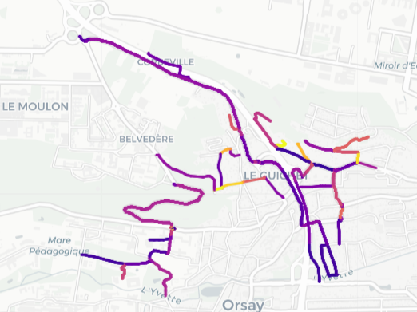

# Optimized-road: an automatic route generator

## Description
The goal is to help creating maps for hike, bike, running .. based on whose weight such as distance, elevations, road popularity, .. based on Open Street Map and Strava HeatMap.

## Visuals
Here is a slection of climbing roads in an area 

## Installation
Done under conda and python 3.11
requirements.in: Lists core dependencies without versions.
requirements.txt: Generated by pip-compile with pinned versions.
dev-requirements.txt: Includes pip-tools and other development dependencies

## Authors and acknowledgment
The initial idea was based on the article (https://medium.com/p/16a266d468a5/edit) and on osmnx-examples/notebooks
/12-node-elevations-edge-grades.ipynb in (https://github.com/gboeing/osmnx-examples/tree/main/notebooks)

	

## Project status

Some ideas for the futur:(see List of OSM-based services)

it can be nice to have an automatic selection

Voiture route gravel, vtt

Utiliser IGN pour route et altimetre

Choix zone (sélection de spots en entourants), zones pour cardinaux cliquer

Poids dénivelé +100 a +100 et pas important
Pourcentage max ? (Faire la liste de toutes les montées ou gravel ou)

QUELQUES CHOIX A PRENDRE EN COMPTE:

Distance (min max)
Direct, vagabonde,..
Tourisme
Bonnes routes, peu circulation,
Heatmap
.
## Some ideas

Add route you already followed previously (My_ppularity)
import gpx (cf https://medium.com/@arbatov/personal-routing-machine-with-gpx-tracks-9a6d2530f7a3)
See Strava Segment (cf Brouter)
https://climbfinder.com/

For spped may be use C++. Cf for instance https://github.com/organicmaps/organicmaps

## LIST of alredy propsed feature

Route Planning

Manual route creation by clicking on the map.
Auto-routing to find the best path between points.
Customizable waypoints and POIs (Points of Interest).
Detailed route editing and adjustments.
Route creation for various types of cycling (road, mountain, commuting).
Navigation

Turn-by-turn voice navigation.
Step-by-step course guidance.
Customizable cue sheets for personalized navigation.
Off-route notifications.
Maps and Views

Standard map view.
Satellite imagery.
Terrain maps with elevation features.
Offline maps for use without internet access.
Elevation and Terrain

Detailed elevation profiles and data.
Elevation gain and loss information.
Options to avoid or maximize hills.
Terrain and surface type information (paved roads, gravel paths, trails).
Route Optimization and Preferences

Fastest, quietest, and balanced route options.
Surface and pathway preferences (road, path, trail).
Popularity heatmaps to suggest popular routes.
Bike type preferences (road bike, mountain bike, etc.).
Community and Sharing

Discover routes created by other users.
Share routes publicly or with friends.
Participate in route challenges.
Community-driven trail reports and reviews.
Integration with Devices

Sync routes with various GPS devices.
Export routes to GPX files.
Seamless integration with specific brands (e.g., Garmin).
Activity Tracking and Analysis

Track rides with GPS.
Analyze past performances.
Estimated distance and duration for planned routes.
Detailed analysis of completed routes.
Points of Interest and Waypoints

Add specific waypoints for rest stops, landmarks, etc.
Mark and view POIs along the route.
Detailed information on POIs (restrooms, water stations, etc.).
Customization and Advanced Features

Drag and drop to modify routes.
Undo and redo options for easy adjustments.
Create and follow personal or group challenges.
Trail difficulty ratings and reports.
Extensive trail databases for mountain biking.

## List of new possible stuff

Weather Integration

Real-time weather updates and forecasts for planned routes.
Weather-based route suggestions to avoid adverse conditions.
Safety Features

Incident reporting and alerts for hazards or accidents.
Integration with emergency contacts and services.
Lighting and visibility recommendations based on time and location.
Traffic Data

Real-time traffic updates and congestion information.
Suggested detours and alternative routes to avoid heavy traffic.
Social Features

Group ride planning and coordination.
In-app messaging and communication for group rides.
Live tracking and sharing location with friends and family during rides.
Health and Fitness Integration

Integration with heart rate monitors and power meters.
Personalized training plans and workouts based on route profiles.
Nutritional and hydration reminders and tracking.
Environmental Impact

Carbon footprint tracking for routes.
Encouragement of eco-friendly routes and practices.
Virtual Rides and Simulations

Virtual ride simulations using route data.
Integration with indoor training platforms (e.g., Zwift).
Augmented reality features for virtual pre-riding routes.
Enhanced Route Customization

AI-based route recommendations tailored to user preferences.
Custom alerts for specific route segments (e.g., steep hills, scenic views).
Dynamic re-routing based on real-time conditions.
Advanced Data Analytics

Heatmap generation based on personal ride data.
Historical performance comparison on the same route.
Advanced metrics and visualizations for ride analysis.
Local Amenities and Services

Information on nearby bike shops, repair stations, and rental services.
Recommendations for cafes, restaurants, and rest stops.
Integration with local cycling events and activities.
Multi-Modal Route Planning

Integration with public transportation for bike-and-ride options.
Seamless transitions between cycling and other modes of transport.
Customizable User Interface

Tailored dashboards based on user preferences.
Accessibility options for visually impaired users.
Multilingual support for a global user base.
Gamification and Rewards

Achievement badges and rewards for completing certain routes or challenges.
Leaderboards and competitive elements within the community.
Points or incentives for frequent use and exploration.

